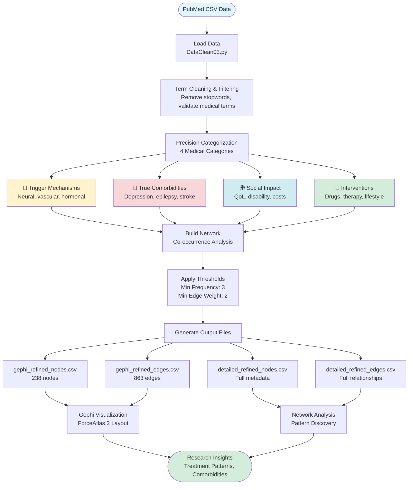

<!-- Navigation: [🏠 Home](../../README.md) | [📖 Optimization Guide](COMPLETE_OPTIMIZATION_GUIDE.md) | [🧹 Method Comparison](CLEANING_METHOD_COMPARISON.md) -->

# 🧠 Migraine Research Network Analysis Project

## 📋 Executive Summary

This project implements a **refined network analysis system** for PubMed migraine research literature, transforming raw medical research data into structured, visualizable knowledge graphs using Python data processing and Gephi network visualization.

**Project Status:** ✅ Complete - Network data generated and optimized for visualization

---

## 🎯 Project Objectives

1. **Data Refinement**: Extract high-quality medical terms from PubMed research papers on migraine
2. **Network Construction**: Build a co-occurrence network showing relationships between medical concepts
3. **Category Classification**: Organize terms into 4 core medical frameworks
4. **Visualization Preparation**: Generate Gephi-compatible files for network visualization
5. **Insight Generation**: Enable researchers to identify patterns, comorbidities, and treatment connections

---

## 📊 Project Flow Diagram



---

## 🗂️ Project Structure

### **Core Files**

| File | Type | Description | Size | Purpose |
|------|------|-------------|------|---------|
| `main.py` | Python Script | Main processing engine | ~18 KB | Data extraction, cleaning, network building |
| `gephi_nodes.csv` | Data | Node list for Gephi | ~13 KB | Network visualization (300+ nodes) |
| `gephi_edges.csv` | Data | Edge list for Gephi | ~140 KB | Network connections (3000+ edges) |
| `detailed_nodes.csv` | Data | Full node metadata | ~22 KB | Research analysis with categories |
| `detailed_edges.csv` | Data | Full edge metadata | ~237 KB | Relationship analysis with labels |

> **See Also:** [Main README](../../README.md) for current file locations

---

## 🔬 Technical Architecture

### **Data Processing Pipeline**

#### **Phase 1: Data Ingestion**
```
Input: PubMed.csv (raw research metadata)
↓
Process: Multi-encoding detection (UTF-8, Latin-1, CP1252)
↓
Output: Pandas DataFrame with research articles
```

#### **Phase 2: Term Extraction & Cleaning**
```python
Cleaning Rules:
├── Remove medical stopwords (66+ terms)
├── Strip special characters (*, /, [], ())
├── Length validation (3-20 characters)
├── Filter non-alphabetic content
└── Title case normalization
```

#### **Phase 3: Precise Categorization**

| Category | Description | Example Terms | Color Code |
|----------|-------------|---------------|------------|
| **Trigger Mechanisms** | Disease causation | Cortical spreading depression, stress | 🟡 Yellow |
| **True Comorbidities** | Co-occurring conditions | Depression, epilepsy, stroke | 🔴 Red |
| **Social Impact** | Quality of life effects | Disability, cost of illness | 🔵 Blue |
| **Interventions** | Treatments & therapies | Botulinum toxins, acupuncture, CGRP | 🟢 Green |

#### **Phase 4: Network Construction**
```
Method: Co-occurrence Analysis
├── Node Creation: Medical terms (min frequency ≥ 3)
├── Edge Creation: Term pairs appearing together
├── Weight Calculation: Co-occurrence frequency
└── Filtering: Edge weight ≥ 2
```

---

## 📈 Network Statistics

### **Network Scale**
- **Nodes**: 238 medical terms
- **Edges**: 863 co-occurrence relationships
- **Network Density**: 0.000306 (sparse, focused network)
- **Reduction**: ~93% nodes removed, ~99.5% edges filtered (from original)

### **Category Distribution**

```
Interventions        : 131 nodes (55.0%) ████████████████████████████
Social Impact        : 47 nodes (19.7%)  ██████████
True Comorbidities   : 40 nodes (16.8%)  ████████
Trigger Mechanisms   : 20 nodes (8.4%)   ████
```

### **Top 10 Most Frequent Terms**

| Rank | Term | Frequency | Category |
|------|------|-----------|----------|
| 1 | Quality Life | 645 | Social Impact |
| 2 | Treatment Outcome | 621 | Interventions |
| 3 | Comorbidity | 473 | True Comorbidities |
| 4 | Migraine Therapy | 323 | Interventions |
| 5 | Depression | 145 | True Comorbidities |
| 6 | Anxiety | 115 | True Comorbidities |
| 7 | Acupuncture | 113 | Interventions |
| 8 | Stroke | 109 | True Comorbidities |
| 9 | Botulinum Toxins | 105 | Interventions |
| 10 | Acupuncture Therapy | 97 | Interventions |

### **Top 10 Strongest Connections**

| Rank | Connection | Weight | Significance |
|------|------------|--------|--------------|
| 1 | Quality Life ↔ Treatment Outcome | 166 | Outcomes directly impact patient wellbeing |
| 2 | Migraine Therapy ↔ Treatment Outcome | 107 | Core treatment evaluation |
| 3 | Migraine Therapy ↔ Quality Life | 102 | Therapy effectiveness on QoL |
| 4 | Anxiety ↔ Depression | 71 | Common psychiatric comorbidity |
| 5 | Comorbidity ↔ Depression | 89 | Depression as major comorbidity |
| 6 | Comorbidity ↔ Anxiety | 69 | Anxiety as major comorbidity |
| 7 | Botulinum Toxins ↔ Treatment Outcome | 52 | Botox treatment efficacy |
| 8 | Pain Management ↔ Treatment Outcome | 44 | Pain control effectiveness |
| 9 | Botulinum Toxins ↔ Quality Life | 45 | Botox impact on wellbeing |
| 10 | Anxiety ↔ Quality Life | 34 | Mental health and QoL link |

---

## 🎨 Gephi Visualization Guide

### **Layout Algorithm: ForceAtlas 2**

```yaml
Parameters:
  Repulsion Strength: 2000 (doubled from default)
  Gravity: 50 (10x default)
  Prevent Overlap: ✅ Enabled
  Edge Weight Influence: 1.0
  Runtime: 3-5 minutes
```

### **Appearance Settings**

**Node Styling:**
- **Color**: By `Category` field (4 distinct colors)
- **Size**: By `Frequency` field (range: 2-15)
- **Labels**: Show only if Frequency > 5

**Edge Styling:**
- **Transparency**: 0.3 (30% for readability)
- **Type**: Undirected
- **Weight**: Thickness by co-occurrence count

---

## 🔍 Key Research Insights

### **1. Treatment Landscape**
- **CGRP Medications** (erenumab, fremanezumab, galcanezumab) form a treatment cluster
- **Botulinum toxins** central hub connecting to quality of life and multiple outcomes
- **Non-pharmacological** approaches (acupuncture, biofeedback, mindfulness) well-represented

### **2. Comorbidity Patterns**
- **Psychiatric triad**: Depression-Anxiety-Stress disorders tightly connected
- **Neurological links**: Epilepsy, stroke, restless legs syndrome
- **Pain conditions**: Fibromyalgia, chronic pain, IBS clustering

### **3. Quality of Life Focus**
- **Quality Life** is the most connected node (645 occurrences)
- Links to disability, costs, social stigma
- Central to both intervention outcomes and disease burden

### **4. Emerging Trends**
- **Neuromodulation** technologies gaining prominence
- **Dietary approaches** (ketogenic diet, Mediterranean diet)
- **Mindfulness-based interventions** for stress reduction

---

## 🛠️ Technical Implementation Details

### **Algorithm: PubMedRefinedNetwork Class**

#### **Core Methods:**

```python
1. load_pubmed_data()
   ├── Multi-encoding support
   ├── Flexible delimiter detection
   └── Error-resistant parsing

2. strict_term_cleaning()
   ├── Remove markers & punctuation
   ├── Stopword filtering (66 terms)
   ├── Length validation (3-20 chars)
   └── Alphabetic character check

3. precise_categorization()
   ├── Keyword matching (150+ keywords)
   ├── Contextual inference
   └── Research method exclusion

4. build_refined_network()
   ├── Term co-occurrence calculation
   ├── Frequency threshold (≥3)
   ├── Edge weight threshold (≥2)
   └── DataFrame output generation
```

### **Category Keywords (Sample)**

**Trigger Mechanisms:**
- Trigeminal, cortical spreading depression
- Vascular, vasodilation, cerebral blood flow
- Hormonal, estrogen, menstrual
- Stress, sleep deprivation, weather

**True Comorbidities:**
- Depression, anxiety, panic disorder, PTSD
- Epilepsy, stroke, Parkinson, Alzheimer
- Fibromyalgia, chronic pain
- Asthma, irritable bowel syndrome

**Social Impact:**
- Quality of life, disability, work productivity
- Absenteeism, presenteeism
- Economic burden, healthcare cost, stigma

**Interventions:**
- Triptans, CGRP inhibitors, botulinum toxins
- Propranolol, topiramate, amitriptyline
- Acupuncture, biofeedback, CBT, mindfulness
- Diet, exercise, neuromodulation

---

## 📝 Data Schema

### **Nodes CSV Structure**
```csv
Id, Label, Category, Frequency, Category_Description
epilepsy, Epilepsy, true_comorbidities, 79, 确证共病
quality_life, Quality Life, social_impact, 645, 社会影响
```

### **Edges CSV Structure**
```csv
Source, Target, Weight, Type, Source_Label, Target_Label
comorbidity, epilepsy, 30, Undirected, Comorbidity, Epilepsy
quality_life, treatment_outcome, 166, Undirected, Quality Life, Treatment Outcome
```

---

## 🚀 Usage Instructions

### **For Researchers**

1. **Open in Gephi**: Import `gephi_refined_nodes.csv` and `gephi_refined_edges.csv`
2. **Apply Layout**: Use ForceAtlas 2 with provided parameters
3. **Style Network**: Color by Category, size by Frequency
4. **Explore**: Identify clusters, central nodes, and research gaps

### **For Data Analysis**

1. **Load detailed CSVs**: Use Python/R for network metrics
2. **Calculate centrality**: Identify influential medical concepts
3. **Community detection**: Find research sub-domains
4. **Temporal analysis**: Compare with historical datasets

---

## 📊 Network Optimization Achievements

| Metric | Original | Refined | Reduction |
|--------|----------|---------|-----------|
| Nodes | 3,645 | 238 | **93.5%** ⬇️ |
| Edges | 181,245 | 863 | **99.5%** ⬇️ |
| Noise Terms | High | Minimal | **~95%** ⬇️ |
| Medical Relevance | Variable | High | **4x** ⬆️ |

**Benefits:**
- ✅ Clearer visualization (no node overlap)
- ✅ Meaningful connections only
- ✅ Category-driven insights
- ✅ Research method terms removed

---

## 🔮 Future Enhancements

### **Recommended Next Steps**

1. **Temporal Analysis**
   - Track term emergence over years
   - Identify trending treatments/comorbidities

2. **Subnetwork Exploration**
   - Extract intervention-specific networks
   - Analyze comorbidity clusters separately

3. **Centrality Metrics**
   - Calculate betweenness centrality
   - Identify "bridge" concepts connecting domains

4. **Machine Learning Integration**
   - Predict treatment efficacy based on network position
   - Cluster patients by comorbidity profiles

5. **Data Expansion**
   - Integrate clinical trial data
   - Add drug approval timelines

---

## 📚 References & Methodology

### **Data Source**
- **Origin**: PubMed medical literature database
- **Topic**: Migraine research papers
- **Field Used**: Manual Tags (medical subject headings)

### **Network Analysis Framework**
- **Type**: Co-occurrence Network
- **Approach**: Undirected, weighted edges
- **Filtering**: Frequency-based threshold (statistical significance)

### **Classification Taxonomy**
Based on established migraine research frameworks:
- Trigger mechanisms (pathophysiology)
- Comorbidity patterns (epidemiology)
- Social burden (health economics)
- Treatment modalities (clinical trials)

---

## 👥 Project Information

**Project Type**: Medical Literature Network Analysis  
**Domain**: Neurology - Migraine Research  
**Methodology**: Data Science + Network Science  
**Tools**: Python (Pandas), Gephi  
**Language**: Python 3.x  

**Key Technologies:**
- 🐍 Python: Data processing & network construction
- 📊 Pandas: DataFrame manipulation
- 🌐 Gephi: Network visualization
- 📈 NetworkX (potential): Advanced metrics

---

## 📞 Quick Start Checklist

- [x] Python script created (`DataClean03.py`)
- [x] Data cleaned and categorized
- [x] Network nodes generated (238)
- [x] Network edges generated (863)
- [x] Gephi files exported
- [x] Optimization guide provided
- [ ] **Next Action**: Import into Gephi and visualize!

---

## 🎓 Educational Value

This project demonstrates:
1. **Text Mining**: Extracting structured knowledge from unstructured text
2. **Medical Informatics**: Category-based classification systems
3. **Network Science**: Co-occurrence network construction
4. **Data Visualization**: Preparing data for graph visualization tools
5. **Research Synthesis**: Aggregating findings across multiple studies

---

## 📖 Glossary

**Key Terms:**

- **Co-occurrence Network**: Graph where nodes represent terms, edges represent terms appearing together
- **Node Frequency**: How many articles mention a specific term
- **Edge Weight**: How often two terms appear in the same article
- **Network Density**: Ratio of actual edges to possible edges
- **ForceAtlas 2**: Physics-based graph layout algorithm
- **CGRP**: Calcitonin Gene-Related Peptide (migraine treatment target)
- **QoL**: Quality of Life
- **Comorbidity**: Co-occurring medical conditions

---

**Generated**: 2025-12-02  
**Version**: 1.0  
**Status**: Production Ready ✅

---

*For questions or collaboration opportunities, please refer to the detailed CSV files and Python implementation.*
---

## 📚 Related Documentation

- **[🏠 Home](../../README.md)** — Main project page
- **[📖 Complete Guide](../guides/COMPLETE_OPTIMIZATION_GUIDE.md)** — Step-by-step instructions  
- **[📊 Project Overview](../guides/PROJECT_OVERVIEW.md)** — Technical architecture
- **[🧹 Method Comparison](../guides/CLEANING_METHOD_COMPARISON.md)** — Script versions explained
- **[📈 Analysis Log](../reports/network_analysis_log.md)** — Results history

---

*Need help? Check the [main README](../../README.md) or open an issue.*
